# FreeIdeas
## The project
The FreeIdeas project was born to give everybody a place where share ideas. Everyone can publish their own ideas, and all the published ideas are at the same level. We give visibility to each idea, for example showing the last ideas on the home page, or ordering by default the ideas from the newest to the oldest in the search page. Our goal is to create an international community where creatives share their ideas and help others realize theirs.

---

*If you are looking for non-technical informations please see the [README.md](README.md) file.*

---

## Features
### Ideas
- Publish an idea
- Update an old idea
- Save an idea
- Vote an idea
- Follow an idea
- Report an idea
- Comment an idea
- Delete an old comment that you have published
- Delete an old idea
- See the author's username (and visit it's account page if the account is public)
- Required fields to publish an idea:
    - Title
    - Description
    - Main image
    - A license:
        - You can use the default license (The *FreeIdeas License*)
        - You can load a personalized license (only *pdf* files)
- Optional fields:
    - External link
    - Additional informations:
        - Image
        - Title
        - Description
    - Logs:
        - Title
        - Description
        - Date (automatically set to the current date)

### Accounts
- Logged user account:
    - Update their account informations
    - Made their account public or private
    - Send an email to change the password of their account
    - Delete their account
    - Recive notifications when a followed idea is edited or deleted
    - Recive notifications when a followed account is edited or deleted
    - Recive notifications when you publish an idea
    - Recive notifications when you delete an idea
    - Recive notifications when you change your account informations
- Others account:
    - Follow an account
    - Report an account
- See their saved ideas
- See their published ideas
- Users can't visit the account's page if the target account is private

### Reserved Area
- Login as administrator
- Logout
- Manage accounts:
    - See all the accounts informations (both for public and private accounts)
    - Search an account
    - Edit all the accounts informations (except for the password)
    - Delete an account
- Manage ideas:
    - See all the ideas informations
    - Search an idea
    - Edit all the ideas informations
    - Delete an idea
    - Delete the comments of an idea
- Manage notifications:
    - See all the notifications
    - Search a notification
    - Delete a notification
    - Create a new notification
        - Title
        - Date
        - Description
        - Account
        - Status:
            - Read
            - Not read
- Manage reports:
    - See all the reports
    - Search a report
    - Delete a report

### Other
- Search an idea
- Search a public account
- Create an account
- Login
- Logout
- Visit a random idea page
- Send feedbacks
- Each idea have an unique link
- Each public account have an unique link
- Light color theme
- Dark color theme
- Responsive (usable from computers, phones and tablets)

## Technologies used
- HTML
- CSS
- Next.js
- React
- Vercel

## Methods used
- HTTP / HTTPS: to send the pages to the client
- POST: to send and recive the data of the forms in a secure way
- GET: to manage the univoque links for the ideas and the accounts

## Software requirements
- A DBMS (for the development it's been used MySQL).
- Nginx (or an equivalent) to run a webserver.
- NPM to install the dependencies.
- Next to run the back-end.
- React for the front-end.
- Vite for the dependencies.

## Files
```
FreeIdeas/
├── components/
│   ├── reserved/
│   │   ├── AccountEditModal.jsx
│   │   ├── AccountsView.jsx
│   │   ├── IdeaEditModal.jsx
│   │   ├── IdeasView.jsx
│   │   ├── NotificationsView.jsx
│   │   ├── ReportsView.jsx
│   │   └── WelcomeView.jsx
│   ├── Footer.jsx
│   ├── Head.jsx
│   ├── LoginForm.jsx
│   ├── Modal.jsx
│   ├── ModalProvider.jsx
│   ├── Nav.jsx
│   └── PasswordInput.jsx
├── contexts/
│   └── CommonContext.js
├── hooks/
│   ├── useAuth.js
│   ├── useModals.js
│   ├── useNotifications.js
│   ├── usePasswordVisibility.js
│   └── useThemeImages.js
├── lib/
│   ├── cors.js
│   ├── db_connection.js
│   └── session.js
├── pages/
│   ├── account/
│   │   └── [id].js
│   ├── api/
│   │   ├── changePassword.js
│   │   ├── createNewNotificationAdmin.js
│   │   ├── data.js
│   │   ├── deleteAccount.js
│   │   ├── deleteComment.js
│   │   ├── deleteIdea.js
│   │   ├── deleteNotification.js
│   │   ├── deleteNotificationAdmin.js
│   │   ├── deleteReportAdmin.js
│   │   ├── followAccountIdea.js
│   │   ├── getAccountData.js
│   │   ├── getAccountDataForReservedArea.js
│   │   ├── getFreeIdeasLicense.js
│   │   ├── getIdeaDataForReservedArea.js
│   │   ├── getLastIdeas.js
│   │   ├── getNotificationsDataForReservedArea.js
│   │   ├── getRandomIdeaId.js
│   │   ├── getReportsDataForReservedArea.js
│   │   ├── getSessionData.js
│   │   ├── login.js
│   │   ├── logout.js
│   │   ├── modifyAccountInfo.js
│   │   ├── modifyIdeaInfoAdmin.js
│   │   ├── reportIdeaAccount.js
│   │   ├── reservedAreaLogin.js
│   │   ├── saveAccountIdeaData.js
│   │   ├── saveNewComment.js
│   │   ├── saveNewIdea.js
│   │   ├── searchAnIdea.js
│   │   ├── setNotificationAsRead.js
│   │   ├── signUp.js
│   │   └── updateOldIdea.js
│   ├── idea/
│   │   └── [id].js
│   ├── publishAnIdea/
│   │   └── [id].js
│   ├── _app.js
│   ├── _document.js
│   ├── about.js
│   ├── account.js
│   ├── contacts.js
│   ├── createAccount.js
│   ├── faq.js
│   ├── feedback.js
│   ├── index.js
│   ├── licensePage.js
│   ├── login.js
│   ├── privacyPolicy.js
│   ├── publishAnIdea.js
│   ├── reservedArea.js
│   ├── searchAnIdea.js
│   └── termsOfUse.js
├── public/
│   └── images/
│       ├── logo/
│       │   ├── FreeIdeas_official_logos.zip
│       │   ├── FreeIdeas_Pro.svg
│       │   ├── FreeIdeas_ReservedArea.svg
│       │   └── FreeIdeas.svg
│       └── ...                                 # Omitted because too many files
├── styles/
│   ├── LoginForm.module.css
│   ├── Modal.module.css
│   ├── PasswordToggle.module.css
│   └── styles.css
├── utils/
│   ├── apiConfig.js
│   ├── errorHandling.js
│   └── fetchWithTimeout.js
├── .gitignore
├── favicon.svg
├── FreeIdeasLicense.md
├── LICENSE.md
├── next.config.js
├── package.json
├── proxy.js
├── README.md
├── robots.txt
├── sitemap.xml
└── TECHNICAL_REPORT.md
```

## Dependencies
```bash
npm install next react react-dom
```
```bash
npm install mysql2
```
```bash
npm install bcrypt
```
```bash
npm install nodemailer
```
```bash
npm install formidable
```
```bash
npm install iron-session
```

## ENV Variables
```
DB_HOST

DB_USER

DB_PASSWORD

DB_NAME

SECRET_COOKIE_PASSWORD

EMAIL_NODE_MAILER

PASSWORD_NODE_MAILER

NEXT_PUBLIC_API_URL     # Only for the front-end

SITE_URL
```

## 🛢 DataBase structure
### Accounts
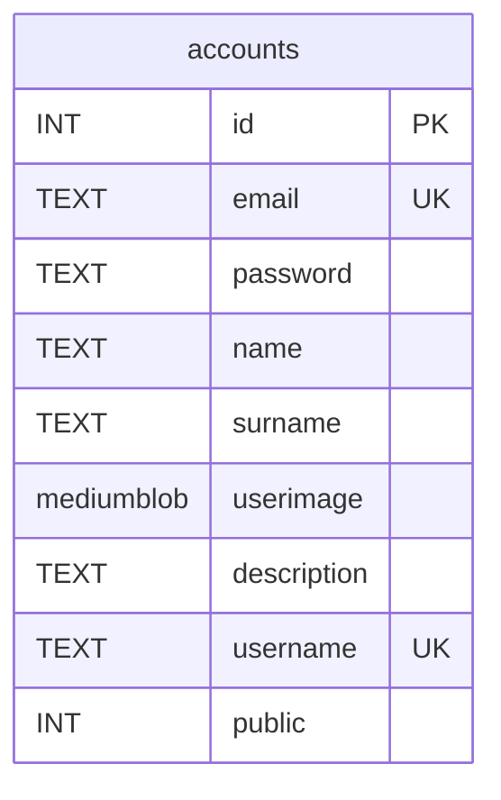

```SQL
CREATE TABLE accounts (
    id INT NOT NULL AUTO_INCREMENT,
    email TEXT NOT NULL UNIQUE,
    password TEXT NOT NULL,
    name TEXT NOT NULL,
    surname TEXT NOT NULL,
    userimage mediumblob,
    description TEXT,
    username TEXT NOT NULL UNIQUE,
    public INT NOT NULL,
    PRIMARY KEY (id)
);
```

### Ideas
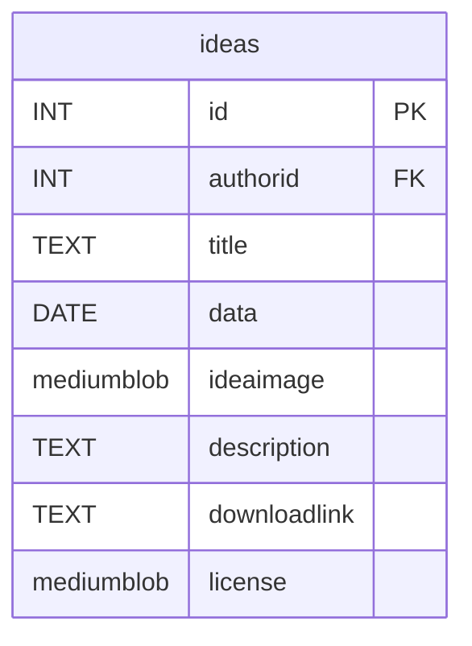

```SQL
CREATE TABLE ideas (
    id INT NOT NULL AUTO_INCREMENT,
    authorid INT NOT NULL,
    title TEXT NOT NULL,
    data DATE NOT NULL,
    ideaimage mediumblob,
    description TEXT NOT NULL,
    downloadlink TEXT,
    license mediumblob,
    PRIMARY KEY (id),
    FOREIGN KEY (authorid) REFERENCES accounts(id)
);
```

### Additional info
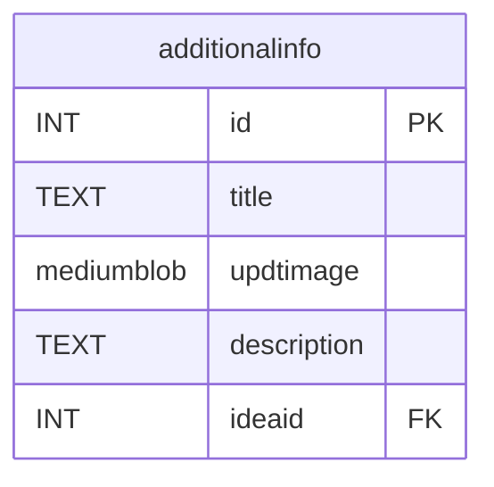

```SQL
CREATE TABLE additionalinfo (
    id INT NOT NULL AUTO_INCREMENT,
    title TEXT NOT NULL,
    updtimage mediumblob NOT NULL,
    description TEXT NOT NULL,
    ideaid INT NOT NULL,
    PRIMARY KEY (id),
    FOREIGN KEY (ideaid) REFERENCES ideas(id)
);
```

### Author Updates
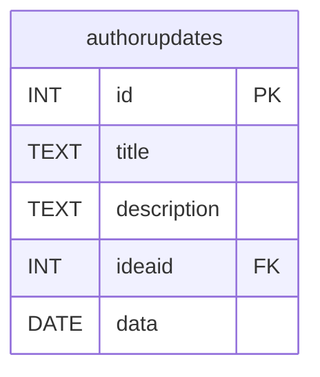

```SQL
CREATE TABLE authorupdates (
    id INT NOT NULL AUTO_INCREMENT,
    title TEXT NOT NULL,
    description TEXT,
    ideaid INT NOT NULL,
    data DATE NOT NULL,
    PRIMARY KEY (id),
    FOREIGN KEY (ideaid) REFERENCES ideas(id)
);
```

### Comments and help
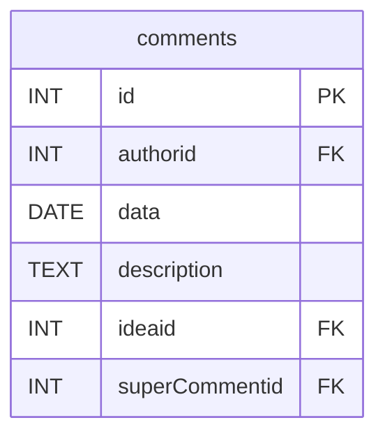

```SQL
CREATE TABLE comments (
    id INT NOT NULL AUTO_INCREMENT,
    authorid INT NULL,
    data DATE NOT NULL,
    description TEXT NOT NULL,
    ideaid INT NOT NULL,
    superCommentid INT,
    PRIMARY KEY (id),
    FOREIGN KEY (authorid) REFERENCES accounts(id),
    FOREIGN KEY (ideaid) REFERENCES ideas(id),
    FOREIGN KEY (superCommentid) REFERENCES comments(id)
);
```

### Labels of a project
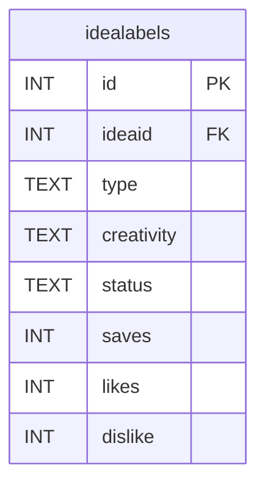

```SQL
CREATE TABLE idealabels (
    id INT NOT NULL AUTO_INCREMENT,
    ideaid INT NOT NULL,
    type TEXT NOT NULL,
    creativity TEXT NOT NULL,
    status TEXT NOT NULL,
    saves INT NOT NULL,
    likes INT NOT NULL,
    dislike INT NOT NULL,
    PRIMARY KEY (id),
    FOREIGN KEY (ideaid) REFERENCES ideas(id)
);
```

### Account additional data about ideas
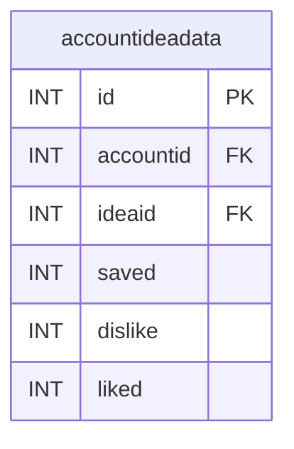

```SQL
CREATE TABLE accountideadata (
    id INT NOT NULL AUTO_INCREMENT,
    accountid INT NOT NULL,
    ideaid INT NOT NULL,
    saved INT,
    dislike INT,
    liked INT,
    PRIMARY KEY (id),
    FOREIGN KEY (accountid) REFERENCES accounts(id),
    FOREIGN KEY (ideaid) REFERENCES ideas(id)
);
```

### Account notifications
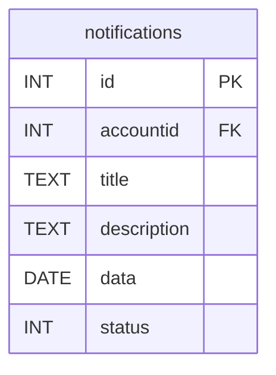

```SQL
CREATE TABLE notifications (
    id INT NOT NULL AUTO_INCREMENT,
    accountid INT NOT NULL,
    title TEXT NOT NULL,
    description TEXT NOT NULL,
    data DATE NOT NULL,
    status INT NOT NULL,
    PRIMARY KEY (id),
    FOREIGN KEY (accountid) REFERENCES accounts(id)
);
```

### Reports (ideas, accounts)
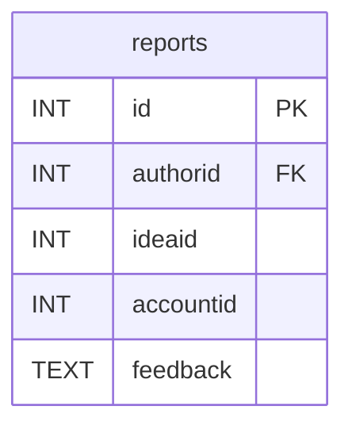

```SQL
CREATE TABLE reports (
    id INT NOT NULL AUTO_INCREMENT,
    authorid INT NOT NULL,
    ideaid INT,
    accountid INT,
    feedback TEXT NOT NULL,
    PRIMARY KEY (id),
    FOREIGN KEY (authorid) REFERENCES accounts(id)
);
```

### Follow (ideas, accounts)
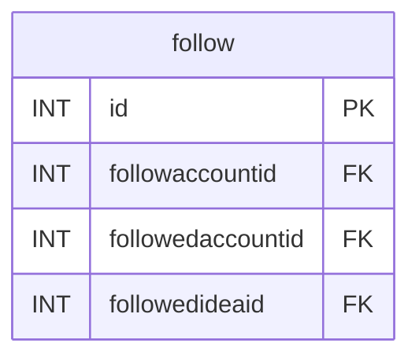

```SQL
CREATE TABLE follow (
    id INT NOT NULL AUTO_INCREMENT,
    followaccountid INT NOT NULL,
    followedaccountid INT,
    followedideaid INT,
    PRIMARY KEY (id),
    FOREIGN KEY (followaccountid) REFERENCES accounts(id),
    FOREIGN KEY (followedaccountid) REFERENCES accounts(id),
    FOREIGN KEY (followedideaid) REFERENCES ideas(id)
);
```

### Reserved Area Accounts
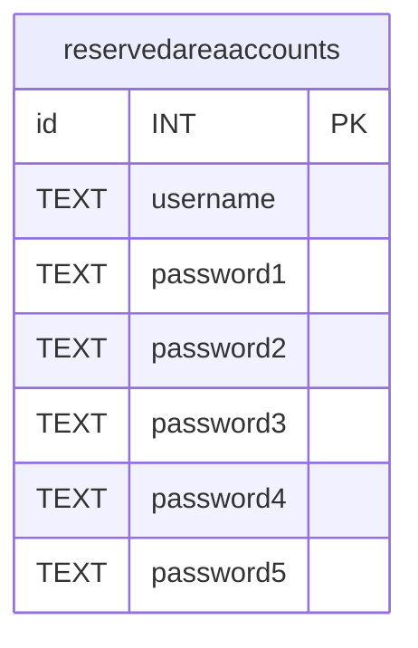

```SQL
CREATE TABLE reservedareaaccounts (
    id INT NOT NULL AUTO_INCREMENT,
    username TEXT NOT NULL,
    password1 TEXT NOT NULL,
    password2 TEXT NOT NULL,
    password3 TEXT NOT NULL,
    password4 TEXT NOT NULL,
    password5 TEXT NOT NULL,
    PRIMARY KEY (id)
);
```

## Entity Relationship Diagrams
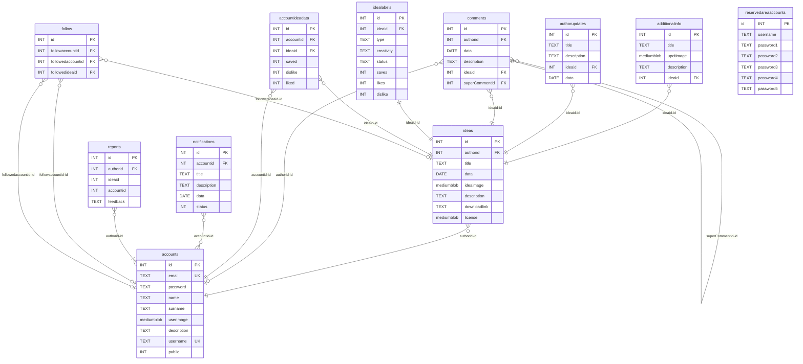

## Database Types
```SQL
mysql> describe accounts;
+-------------+------------+------+-----+---------+----------------+
| Field       | Type       | Null | Key | Default | Extra          |
+-------------+------------+------+-----+---------+----------------+
| id          | int        | NO   | PRI | NULL    | auto_increment |
| email       | text       | NO   |     | NULL    |                |
| password    | text       | NO   |     | NULL    |                |
| name        | text       | NO   |     | NULL    |                |
| surname     | text       | NO   |     | NULL    |                |
| userimage   | mediumblob | YES  |     | NULL    |                |
| description | text       | YES  |     | NULL    |                |
| username    | text       | NO   |     | NULL    |                |
| public      | int        | NO   |     | NULL    |                |
+-------------+------------+------+-----+---------+----------------+

mysql> describe ideas;
+--------------+------------+------+-----+---------+----------------+
| Field        | Type       | Null | Key | Default | Extra          |
+--------------+------------+------+-----+---------+----------------+
| id           | int        | NO   | PRI | NULL    | auto_increment |
| authorid     | int        | NO   | MUL | NULL    |                |
| title        | text       | NO   |     | NULL    |                |
| data         | date       | NO   |     | NULL    |                |
| ideaimage    | mediumblob | YES  |     | NULL    |                |
| description  | text       | NO   |     | NULL    |                |
| downloadlink | text       | YES  |     | NULL    |                |
| license      | mediumblob | YES  |     | NULL    |                |
+--------------+------------+------+-----+---------+----------------+

mysql> describe additionalinfo;
+-------------+------------+------+-----+---------+----------------+
| Field       | Type       | Null | Key | Default | Extra          |
+-------------+------------+------+-----+---------+----------------+
| id          | int        | NO   | PRI | NULL    | auto_increment |
| title       | text       | NO   |     | NULL    |                |
| updtimage   | mediumblob | NO   |     | NULL    |                |
| description | text       | NO   |     | NULL    |                |
| ideaid      | int        | NO   | MUL | NULL    |                |
+-------------+------------+------+-----+---------+----------------+

mysql> describe authorupdates;
+-------------+------+------+-----+---------+----------------+
| Field       | Type | Null | Key | Default | Extra          |
+-------------+------+------+-----+---------+----------------+
| id          | int  | NO   | PRI | NULL    | auto_increment |
| title       | text | NO   |     | NULL    |                |
| description | text | YES  |     | NULL    |                |
| ideaid      | int  | NO   | MUL | NULL    |                |
| data        | date | NO   |     | NULL    |                |
+-------------+------+------+-----+---------+----------------+

mysql> describe comments;
+----------------+------+------+-----+---------+----------------+
| Field          | Type | Null | Key | Default | Extra          |
+----------------+------+------+-----+---------+----------------+
| id             | int  | NO   | PRI | NULL    | auto_increment |
| authorid       | int  | YES  | MUL | NULL    |                |
| data           | date | NO   |     | NULL    |                |
| description    | text | NO   |     | NULL    |                |
| ideaid         | int  | NO   | MUL | NULL    |                |
| superCommentid | int  | YES  | MUL | NULL    |                |
+----------------+------+------+-----+---------+----------------+

mysql> describe idealabels;
+------------+------+------+-----+---------+----------------+
| Field      | Type | Null | Key | Default | Extra          |
+------------+------+------+-----+---------+----------------+
| id         | int  | NO   | PRI | NULL    | auto_increment |
| ideaid     | int  | NO   | MUL | NULL    |                |
| type       | text | NO   |     | NULL    |                |
| creativity | text | NO   |     | NULL    |                |
| status     | text | NO   |     | NULL    |                |
| saves      | int  | NO   |     | NULL    |                |
| likes      | int  | NO   |     | NULL    |                |
| dislike    | int  | NO   |     | NULL    |                |
+------------+------+------+-----+---------+----------------+

mysql> describe accountideadata;
+-----------+------+------+-----+---------+----------------+
| Field     | Type | Null | Key | Default | Extra          |
+-----------+------+------+-----+---------+----------------+
| id        | int  | NO   | PRI | NULL    | auto_increment |
| accountid | int  | NO   | MUL | NULL    |                |
| ideaid    | int  | NO   | MUL | NULL    |                |
| saved     | int  | YES  |     | NULL    |                |
| dislike   | int  | YES  |     | NULL    |                |
| liked     | int  | YES  |     | NULL    |                |
+-----------+------+------+-----+---------+----------------+

mysql> describe notifications;
+-------------+------+------+-----+---------+----------------+
| Field       | Type | Null | Key | Default | Extra          |
+-------------+------+------+-----+---------+----------------+
| id          | int  | NO   | PRI | NULL    | auto_increment |
| accountid   | int  | NO   | MUL | NULL    |                |
| title       | text | NO   |     | NULL    |                |
| description | text | NO   |     | NULL    |                |
| data        | date | NO   |     | NULL    |                |
| status      | int  | NO   |     | NULL    |                |
+-------------+------+------+-----+---------+----------------+

mysql> describe reports;
+-----------+------+------+-----+---------+----------------+
| Field     | Type | Null | Key | Default | Extra          |
+-----------+------+------+-----+---------+----------------+
| id        | int  | NO   | PRI | NULL    | auto_increment |
| authorid  | int  | NO   | MUL | NULL    |                |
| ideaid    | int  | YES  |     | NULL    |                |
| accountid | int  | YES  |     | NULL    |                |
| feedback  | text | NO   |     | NULL    |                |
+-----------+------+------+-----+---------+----------------+

mysql> describe follow;
+-------------------+------+------+-----+---------+----------------+
| Field             | Type | Null | Key | Default | Extra          |
+-------------------+------+------+-----+---------+----------------+
| id                | int  | NO   | PRI | NULL    | auto_increment |
| followaccountid   | int  | NO   | MUL | NULL    |                |
| followedaccountid | int  | YES  | MUL | NULL    |                |
| followedideaid    | int  | YES  | MUL | NULL    |                |
+-------------------+------+------+-----+---------+----------------+

mysql> describe reservedareaaccounts;
+-----------+------+------+-----+---------+----------------+
| Field     | Type | Null | Key | Default | Extra          |
+-----------+------+------+-----+---------+----------------+
| id        | int  | NO   | PRI | NULL    | auto_increment |
| username  | text | NO   |     | NULL    |                |
| password1 | text | NO   |     | NULL    |                |
| password2 | text | NO   |     | NULL    |                |
| password3 | text | NO   |     | NULL    |                |
| password4 | text | NO   |     | NULL    |                |
| password5 | text | NO   |     | NULL    |                |
+-----------+------+------+-----+---------+----------------+
```